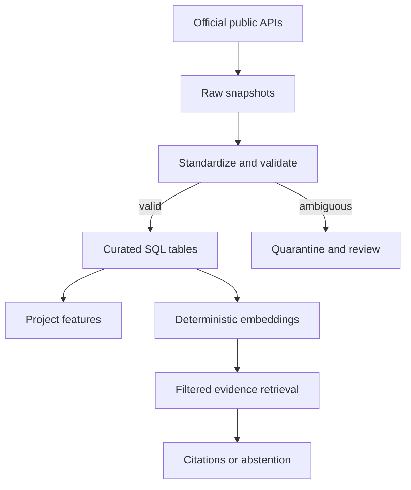
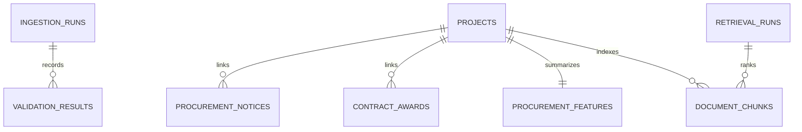

# Procurement Data Modernization Workbench

An independent, testable prototype that migrates public World Bank procurement notices, contract awards, and project metadata into auditable raw, standardized, curated, feature, and retrieval layers.

> **Independent prototype using public World Bank data. Not affiliated with or endorsed by the World Bank Group.** Source records and official pages remain authoritative.

## Executive summary

The workbench demonstrates the core data-engineering responsibilities described for an AI Data Engineer in fiduciary procurement operations: heterogeneous API ingestion, pagination-ready and idempotent processing, source preservation, schema checks, normalization, quarantine, explicit quality controls, project-level integration, feature engineering, deterministic embeddings, filtered retrieval, citation construction, abstention, APIs, tests, and technical documentation.

The verified prototype run uses a bounded sample of **300 procurement notices and 300 contract awards**, then retrieves project metadata for observed project IDs. The source API reported **412,871 procurement notices on 5 August 2026**. The code supports bounded runs up to the official API's documented 1,000-record page size; a production scheduler would iterate pages and checkpoints rather than fit all source records into a free-tier demo.

## Why procurement data infrastructure matters

Procurement records help stakeholders understand how project needs move from notices to awards and supporting evidence. Fragmented formats, missing fields, duplicates, and incomplete linkages make that trail harder to inspect. This prototype preserves uncertainty and lineage while producing datasets that can support analytics and evidence retrieval without treating quality signals as misconduct.

## Official sources and access validation

| Source | Tested access | Key fields used | Important limitation |
|---|---|---|---|
| [Procurement Notices](https://financesone.worldbank.org/procurement-notice/DS00979) | JSON API, `top`/`skip`, max 1,000/page | `id`, `project_id`, title, country, category, method, publication/deadline, sector, URL | Public source reports daily updates; bounded prototype is not the full dataset |
| [Contract Awards](https://datacatalog.worldbank.org/search/dataset/0037797/world-bank-contract-awards) | JSON API, `rows`/`os` | contract ID, project ID, description, supplier, amount, signed date | Officially does not represent every contract; supplier country is registration location |
| [Projects & Operations](https://datacatalog.worldbank.org/search/dataset/0037800/world-bank-projects-operations) | JSON API with project lookup | project ID, name, country, region, sector, total amount | Metadata availability varies by project |
| [Documents & Reports](https://documents.worldbank.org/en/publication/documents-reports/api) | API documentation and sample calls validated | project ID, title, abstract, type, document date, official URLs | Adapter is documented as the next bounded-ingest module; not counted in this verified run |

`project_id` / `projectid` is the valid common key across the operational datasets. The pipeline normalizes it to `P` plus six digits and quarantines invalid values.

## Architecture



- **Raw:** complete retrieved payload, source URLs, retrieval time, run ID, SHA-256 checksum, and detected schema hash.
- **Standardized:** normalized project IDs and ISO dates, preserved raw JSON, validation results, and rejected/quarantined payloads.
- **Curated:** projects, notices, awards, project features, document chunks, embeddings, and retrieval runs.
- **Serving:** typed FastAPI routes and a responsive institutional workbench.

## Data model



See [data dictionary](docs/DATA_DICTIONARY.md) and [control catalog](docs/CONTROL_CATALOG.md).

## Pipeline behavior

- HTTP timeouts and exponential retry for transient failures
- bounded `top`/`skip` or `rows`/`os` ingestion
- immutable raw snapshots and payload checksum
- source-schema fingerprint
- primary-key upserts for idempotence
- normalization with original raw JSON retained
- quality issue and quarantine ledgers
- curated rebuild and feature generation
- deterministic local embedding generation
- retrieval-run logging and abstention

### Feature dataset

One row per project: notice count, award count, supplier count, total award amount, missing-field ratio, project-linkage status, and average quality score. It is suitable for analytics or downstream ML experimentation; this project does not add an arbitrary predictive model.

## Data-quality framework

Every issue stores the control ID, severity, result name, record type and ID, source field, original value, normalized value, run ID, and recommended handling. Controls include missing/invalid project IDs, missing titles, invalid dates, deadline ordering, missing category, incomplete project linkage, and potential duplicate content.

Quality controls are **review signals, not fraud labels**. Ambiguous values are not silently repaired.

## Retrieval methodology and safeguards

Text from notices, awards, and projects is tokenized and mapped to a reproducible 256-dimensional hashing vector. The browser demo searches all 759 indexed records exported from the verified SQLite database using the same SHA-256 bucket mapping, cosine ranking, lexical gate, and abstention threshold as the FastAPI backend. This avoids a hosted key and keeps the prototype deterministic without substituting hard-coded results. PostgreSQL + pgvector and a versioned Sentence Transformers model are the production path.

Safeguards:

- every result contains record type, ID, project ID, excerpt, score, and official URL;
- retrieval score is explicitly a ranking signal, not factual confidence;
- results below the minimum evidence threshold abstain;
- no supplier, country, or project misconduct inference;
- no generated record or citation;
- optional future synthesis must remain visibly separate from retrieved facts.

## API

Run the backend and open `/docs` for OpenAPI.

- `GET /health`
- `GET /ingestion/runs`
- `POST /ingestion/sample`
- `GET /quality/summary`
- `GET /quality/issues`
- `GET /projects`
- `GET /projects/{project_id}`
- `GET /procurement/notices`
- `POST /procurement/search`

## Local setup (macOS and Linux)

Requires Python 3.11+ and Node 22.13+.

```bash
python3 -m venv .venv
source .venv/bin/activate
pip install -r backend/requirements.txt
python -m backend.app.cli ingest-sample --notices 300 --awards 300
uvicorn backend.app.main:app --reload
```

In another terminal:

```bash
npm ci
npm run dev
```

Tests and production build:

```bash
pytest -q
npm test
```

`npm run build` refreshes `public/data/retrieval-corpus.json` from the verified SQLite index before compiling the site, keeping the browser evidence search aligned with the backend corpus.

No Linux-only locking utility is used.

## Environment variables

None are required for the verified SQLite + deterministic retrieval mode. A production deployment would use:

```text
DATABASE_URL=postgresql://...
RAW_STORAGE_BUCKET=...
EMBEDDING_PROVIDER=local
EMBEDDING_MODEL=versioned-model-name
```

No secrets belong in source control.

## Demo

The README and visible navigation intentionally use the same five views:

1. Open **Overview** to see the engineering challenge, verified scope, and guided walkthrough.
2. Open **Pipeline** to follow the 5 August run through raw, standardized, curated, feature, and retrieval layers; inspect reconciliation and source-to-target mappings.
3. Open **Data quality**, select DQ-008, and inspect its rule, affected count, recommended handling, and no-silent-mutation principle.
4. Open **Evidence search**, run `healthcare furniture in Pakistan`, inspect the match explanation and official citation, then run `nuclear procurement on Mars` to observe abstention.
5. Open **Methodology** to compare implemented capabilities with production extensions and review exactly what the tests cover.

## Testing and evaluation

Unit tests cover project/date normalization, idempotent upserts, curated feature generation, vector retrieval, metadata filtering, and abstention. The frontend test performs a production build and checks rendered product/disclaimer content. Exact executed results are recorded in [TEST_REPORT.md](docs/TEST_REPORT.md); no pass claim should be made without that report.

The transparent retrieval evaluation is intentionally small and prototype-scoped. Queries, manual relevance labels, metrics, and limitations are in [RETRIEVAL_EVALUATION.md](docs/RETRIEVAL_EVALUATION.md).

## Responsible AI and known limitations

- Bounded sample only; not full-source coverage.
- Contract Awards is not a complete list of all awards.
- Documents API is validated but is not part of the counted run.
- Hashing embeddings favor exact/near-exact vocabulary and are not multilingual semantic embeddings.
- Prototype uses SQLite; production should use PostgreSQL, pgvector, Alembic, orchestration, object storage, and monitoring.
- Manual evaluation labels are small and authored for this prototype.
- Official records may themselves contain missing or inconsistent metadata.

## Deployment

No external deployment or GitHub push has been performed. Recommended architecture: frontend on Vercel; FastAPI on Railway; PostgreSQL + pgvector on Neon/Supabase/Railway; object storage for raw snapshots. Run the documented tests, set environment variables, execute a bounded seed, then deploy services separately. The public UI must disclose the exact processed scope.

## Production roadmap

1. Complete historical page iteration with checkpoint resume and scheduled incrementals.
2. Add Documents & Reports ingestion and text extraction.
3. Move to PostgreSQL + pgvector with Alembic migrations.
4. Add an embedding-model registry and multilingual retrieval.
5. Expand adjudicated retrieval labels and automated drift monitoring.
6. Add authenticated reviewer actions and remediation history.

## License and attribution

Code: MIT License. World Bank source data is used under the licensing stated on each official catalog page, including CC BY 4.0 where specified. See [ATTRIBUTION.md](docs/ATTRIBUTION.md). World Bank names and source links identify the public data origin only.
